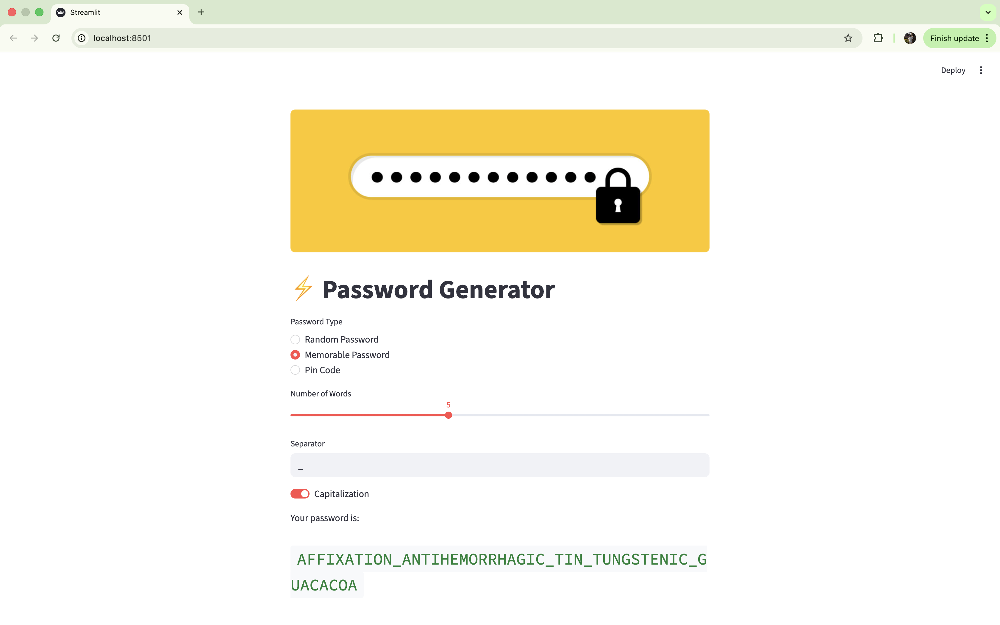

# 🔐 Password Generator App
A modern and customizable password generator built with **Python** and **Streamlit**. This project lets you generate secure passwords in three styles: **Random Passwords**, **Memorable (Word-based) Passwords**, and **Numeric PIN Codes**.

## 🚀 Features
- Random password generation with letters, numbers, and symbols  
- Memorable password generation using real English words (via `nltk`)  
- Secure numeric PIN code creation  
- Simple and interactive Streamlit web interface  
- Fully modular design (easy to extend or modify)

## 🧩 Project Structure
📦 password-generator-app
│
├── app.py                     # Streamlit app (main UI)
├── password_generators.py     # Core password generator classes
├── requirements.txt           # Dependencies list
└── README.md                  # Project documentation

## ⚙️ Installation
1. **Clone the repository**
   ```bash
   git clone https://github.com/<your-username>/password-generator-app.git
   cd password-generator-app
   ```

2. **(Optional) Create and activate a virtual environment**
   ```bash
   python3 -m venv venv
   source venv/bin/activate    # macOS / Linux
   venv\Scripts\activate       # Windows
   ```

3. **Install dependencies**
   ```bash
   pip install -r requirements.txt
   ```

4. **Download NLTK data (for memorable passwords)**
   ```bash
   python
   >>> import nltk
   >>> nltk.download('words')
   >>> exit()
   ```

## 💻 Run the App
Run the Streamlit application locally:
```bash
streamlit run app.py
```
Then open the link shown in the terminal (usually `http://localhost:8501`).

## 🔧 How It Works
### 🔹 RandomPasswordGenerator
Generates a password using letters, optionally including digits and symbols.
```python
from password_generators import RandomPasswordGenerator
gen = RandomPasswordGenerator(length=12, include_numbers=True, include_symbols=True)
print(gen.generate())
```

### 🔹 MemorablePasswordGenerator
Creates human-friendly passwords using English words.
```python
from password_generators import MemorablePasswordGenerator
from nltk.corpus import words
gen = MemorablePasswordGenerator(no_of_words=4, separator="-", capitalization=True, vocabulary=words.words())
print(gen.generate())
```

### 🔹 PinCodeGenerator
Generates numeric-only passwords for quick access or low-security contexts.
```python
from password_generators import PinCodeGenerator
gen = PinCodeGenerator(length=6)
print(gen.generate())
```

## 🧠 Technologies Used
- Python 3.10+
- Streamlit
- NLTK
- Random / String built-ins

## 📸 Screenshot


## 👨‍💻 Author
**ahzrn-dev**  
Building beautiful & practical Python projects 🐍

## 🏷️ License
This project is licensed under the **MIT License** — free for personal and commercial use.
